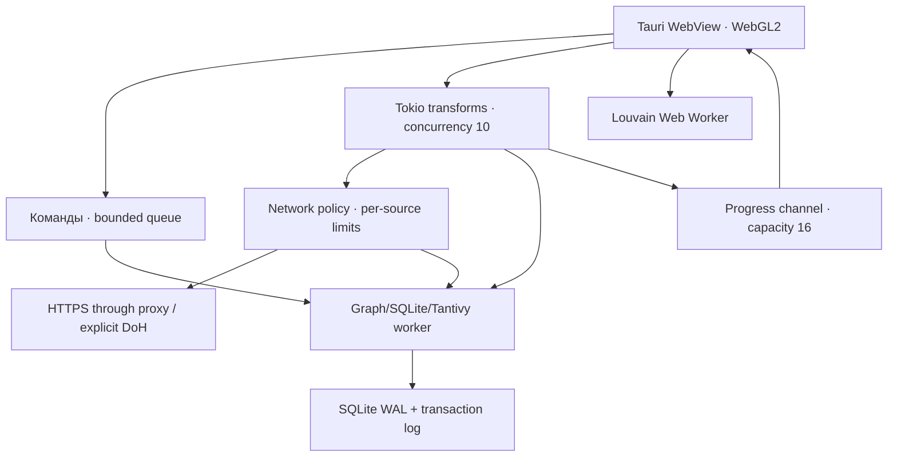

# Архитектура и обоснованные отклонения

## Потоки и владение

`tokio::join_all` не существует: `join_all` относится к futures. Здесь выбран `buffer_unordered(10)`, чтобы обрабатывать завершившиеся результаты сразу и ограничивать число одновременно исполняемых futures.

В сети нет блокирующих SQL-операций. Они передаются worker через канал. UI не получает прямой доступ к HTTP, shell или файловым API Tauri. CPU-bound индексация и fsync выполняются вне event loop GUI. При заполнении очереди producer ожидает, а не накапливает неограниченный список результатов.

В текущей версии команды поиска, экспорта и записи используют один worker; большой экспорт может задержать получение новых результатов и поиск, хотя UI продолжит отрисовку. Следующий шаг — read-only SQLite connections для долгих экспортов и versioned snapshot. Начальное чтение графа выполняется в setup до готовности окна: критерий двух секунд пока не выполнен доказательством.

## Память

`petgraph::StableDiGraph<HotNode, edge_id>` содержит топологию. Атрибуты существуют также в SQL и частично в горячем кеше. Оценка памяти обновляется инкрементально; при нехватке бюджета вытесняются наименее недавно использованные payload. При поиске результаты — только ID; инспектор загружает payload отдельно.

Из 512 MiB настроенного бюджета графу назначается треть. Остальное оставлено для Tantivy, SQLite page cache, сетевых буферов, очередей и WebView. Это **эвристика, не жёсткий лимит процесса**. В RAM сохраняются все topology IDs/edges; настоящая выгрузка холодных компонентов топологии не реализована. Непомещающийся граф отклоняется, а ephemeral режим ничего не выгружает на диск.

Границы: node ≤64 KiB; batch ≤512 nodes / 2048 edges / 2 MiB; HTTP response ≤2 MiB; сохранённый attributes-response ≤48 KiB; cache ≤32 MiB; SQL cache 8 MiB; Tantivy writer 16 MB; progress queue 16. JSON IPC и JS-объекты всё ещё дают дополнительные копии. При больших payload или большом Tantivy-индексе общий бюджет может быть превышен. Rust исключает GC-паузы ядра, но не OOM, фрагментацию аллокатора, GC WebView и нехватку GPU memory.

В статусе честно различены backend RSS (Linux), оценка графа и JS heap в браузере. Суммарный RSS всех WebView-процессов не измеряется. Для hard ceiling нужны Windows Job Object / Linux cgroup либо надёжный платформенный memory sampler + admission; ограничение ОС может завершить приложение, поэтому само по себе не гарантирует graceful behavior.

## Долговечность

Порядок фиксации: validate/merge → admission → запись complete JSONL + `sync_data` → SQLite transaction + applied ID → обновление RAM → индексация производных данных. Сбой после записи намерения восстанавливается повторным применением при следующем запуске. В случае неоднозначной ошибки записи store помечается poisoned и требует восстановления.

Транзакционный журнал содержит полные финальные записи узлов и рёбер. Это позволяет восстановить БД без второго сетевого запроса. Журнал не шифруется и не компактизируется; startup recovery читает его последовательно. Для долгих исследований нужны snapshot/checkpoint и политика архивирования; иначе объём журнала и время старта растут. Файл `session.lock` удерживается через OS-level exclusive lock на время жизни Store; второе открытие того же каталога отклоняется. Межпроцессная проверка этого поведения ещё не запускалась.

## Сеть и границы анонимности

Offline по умолчанию. Настройки окружения HTTP_PROXY/NO_PROXY отключены; системный DNS resolver заменён отказом. Anonymous принимает только явно указанный proxy transport. SOCKS5H передаёт target hostname прокси; CONNECT передаёт hostname на стороне прокси. Bootstrap hostname самого прокси запрещён — нужен IP. TLS certificate verification не выключается. HTTP redirects запрещены. Direct DoH делает HTTPS-запрос к выбранному Google/Cloudflare resolver через заданный bootstrap IP и устанавливает адрес назначения через `resolve_to_addrs`.

Не реализованы: embedded Arti, proxy chains, authenticated proxies, custom DoH resolver, DoH AAAA/failover, отдельные stream isolation identities. Tor/Chain enum variants возвращают ошибку, никогда не переключаются на direct. Для встроенного Arti потребуется также согласовать временное хранение consensus с ephemeral, bootstrap traffic, lifetime фоновых задач и memory budgets.

Wireshark видит соединение к прокси; при прямом Tor он увидит guards/directory bootstrap, не только источники OSINT. Скрыть сам факт сетевых соединений невозможно. Прокси/провайдеры источников и fingerprint клиента остаются частью модели угроз. Настоящий API-ключ отправляется соответствующему провайдеру при авторизации; требование «никогда не покидает машину» совместимо только с отсутствием авторизованных API-запросов. Здесь vault реализован, а отправка API-ключей ещё не подключена.

Автоматического обновления, телеметрии, аналитики, crash-reporting SDK, remote CDN, картографических tiles, логина и облачного sharing нет в коде приложения. Поведение системного WebView/ОС нужно проверять отдельным packet capture.

## Графический слой

Свой WebGL2 renderer выбран вместо sigma/cosmograph: для минимального числа JS-зависимостей и прямого контроля над typed arrays и GPU-буферами. Основная топология представлена индексным буфером Uint32; узлы рисуются GL_POINTS, рёбра GL_LINES. Все координаты интерполируются GPU. Работа по запросу в обычном режиме, непрерывный rAF в нагрузочном демо.

GPU layout ограничивает работу до O(N) выборок на итерацию. Для инкрементальных результатов активируются новые узлы; остальные закреплены. Полная кнопка «Раскладка» активирует все узлы. Метод приближённый, использует только четыре соседних ребра для силы, поэтому не заменяет полноценный ForceAtlas2. Важно: d3-force сам по себе CPU-based, а `regl` не переносит его вычисления на GPU автоматически.

Louvain строит дополнительный JS-граф в Worker; это повышает пик памяти. Hulls выпуклые, пересечения возможны, число отображаемых оболочек ограничено. Нативное детектирование сообществ, оптимизация на CSR и долговечное сохранение community IDs остаются следующими этапами. География сейчас только координатная сетка Canvas без подложки, gazetteer и полноценного geo-link analysis.

## Уровни уверенности

Поле confidence и цветовые кольца есть. Наличие двух источников не доказывает corroboration: два агрегатора могут цитировать один первичный источник. Поэтому автоматического повышения только по длине sources нет. Для честной классификации нужны claim-level evidence, независимость источников, разрешение идентичности, отметки санкций/угроз и действия аналитика. Полная confidence-resolution engine пока отсутствует.

## Сборка и плагины

`inventory` перечисляет регистрации, попавшие в бинарник, и сам по себе не является стабильным динамическим ABI. В текущем решении расширяемость без пересборки реализована для декларативных HTTP/JSON-плагинов. Для произвольного кода подходящий дальнейший вариант — versioned WASM ABI с host-mediated network и quotas; это отдельная работа.

Tauri использует платформенный WebView. «Один бинарник, всё статически, ноль системных зависимостей, ≤50 MB» одновременно с выбранным стеком на всех трёх ОС обещать нельзя. Build toolchain нужен разработчику, runtime — конечному пользователю. Минимальные ОС и размеры должны подтверждаться конкретными release artifacts.

## Первичные источники, проверенные 11 сентября 2026

- [Tauri prerequisites](https://v2.tauri.app/start/prerequisites/) — платформенные зависимости.
- [inventory documentation](https://docs.rs/inventory/latest/inventory/) — модель регистрации.
- [reqwest Proxy](https://docs.rs/reqwest/latest/reqwest/struct.Proxy.html) — proxy API.
- [Arti client documentation](https://docs.rs/arti-client/latest/arti_client/) — bootstrap, persistence и Tor streams.
- [age Decryptor 0.11.1](https://docs.rs/age/0.11.1/age/struct.Decryptor.html) — passphrase decrypt через Identity.
- [HIBP API v3](https://haveibeenpwned.com/API/v3) — требования к доступу API.

Ссылки документируют решения; они не заменяют компиляцию конкретных зависимостей и проверку live API.
